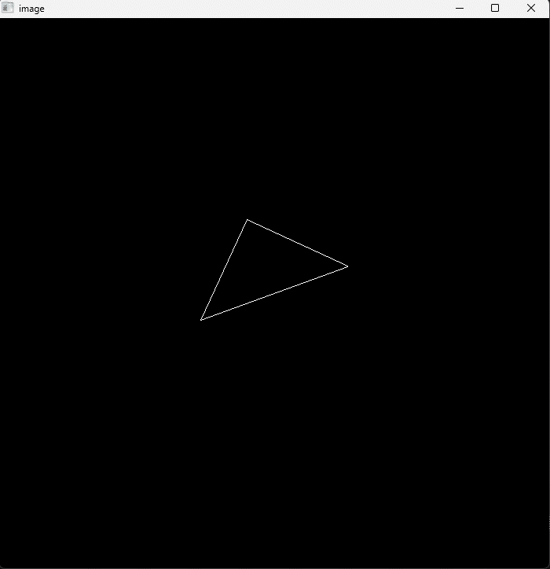
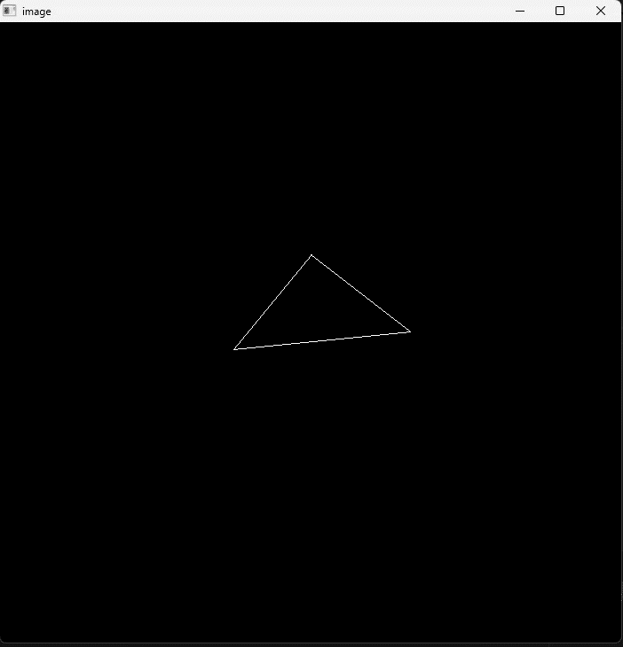
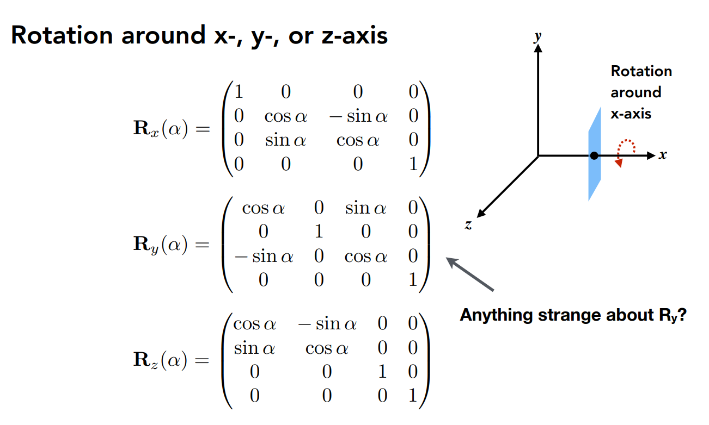

# 作业1

[TOC]

[作业pdf](../Assignment1.pdf)

## 作业成果预览

绕z轴旋转



绕{1, 1, -1}旋转



## 作业详解

需求

1.  get_model_matrix(float rotation_angle): 逐个元素地构建模型变换矩 阵并返回该矩阵。在此函数中，你只需要实现三维中绕 z 轴旋转的变换矩阵， 而不用处理平移与缩放。

   

   ```cpp
   Eigen::Matrix4f get_model_matrix(float rotation_angle)
   {
       Eigen::Matrix4f model = Eigen::Matrix4f::Identity();
       // 角度转弧度制
       float theta = rotation_angle / 180.0 * MY_PI;
       // 绕z轴旋转的旋转矩阵
       Eigen::Matrix4f rotate;
       rotate << 
           cos(theta), -sin(theta),0, 0,
           sin(theta), cos(theta), 0, 0,
           0,          0,          1, 0,
           0,          0,          0, 1;
   
       model = rotate * model;
       return model;
   }
   ```

2.  get_projection_matrix(float eye_fov, float aspect_ratio, float zNear, float zFar): 使用给定的参数逐个元素地构建透视投影矩阵并返回 该矩阵。

   分成三步处理

   1.将透视投影转化为正交投影 

   2.将视景体中心移动到坐标中点 

   3.将视景体缩放到标准化范围[-1,1]

   (详细内容翻阅课件4,太多图不贴了)

   ```cpp
   Eigen::Matrix4f get_projection_matrix(float eye_fov, float aspect_ratio,
                                         float zNear, float zFar)
   {
       // Students will implement this function
   
       Eigen::Matrix4f projection = Eigen::Matrix4f::Identity();
   
       // TODO: Implement this function
       // Create the projection matrix for the given parameters.
       // Then return it.
   
       // 计算视景体的数据
       float height = 2.0 * tan(eye_fov / 180.0 * MY_PI) * fabs(zNear);
       float width = height * aspect_ratio;
       float deep = fabs(zNear - zFar); 
   
       Eigen::Matrix4f scale, translate, persp2ortho;
       scale << // 缩放到标准化范围[-1,1]
           2.0/width, 0,          0,        0,
           0,         2.0/height, 0,        0,
           0,         0,          2.0/deep, 0,
           0,         0,          0,        1;
   
       translate << // 将视景体中心移动到(0, 0).用fov和ratio计算xy轴均匀分布,不需要平移
           1, 0, 0, 0,
           0, 1, 0, 0,
           0, 0, 1, -(zNear + zFar)/2.0, 
           0, 0, 0, 1;
   
       persp2ortho << // 将透视投影转化为正交投影
           zNear, 0,     0,            0,
           0,     zNear, 0,            0,
           0,     0,     zNear + zFar, -zNear*zFar,
           0,     0,     1,            0;
   
       projection = scale * translate * persp2ortho * projection;
       return projection;
   }
   ```

课程中提到摄像机朝向z的负方向看去,所以near和far都应该是负的且 near>far

因此修改main函数中near和far的值改为负数

`r.set_projection(get_projection_matrix(45, 1, -0.1, -50));`

## 额外内容1

在 main.cpp 中构造一个函数，该函数的作用是得到绕任意 过原点的轴的旋转变换矩阵。 `Eigen::Matrix4f get_rotation(Vector3f axis, float angle)`

使用罗德里格旋转公式（Rodrigues' rotation formula）

```cpp
Eigen::Matrix4f get_rotation(Vector3f axis, float angle)
{
    float theta = angle / 180.0 * MY_PI;
    axis.normalize();
    Eigen::Matrix3f xProductM;
    xProductM << 
        0,         -axis.z(), axis.y(),  
        axis.z(),  0,         -axis.x(), 
        -axis.y(), axis.x(),  0;
    Eigen::Matrix3f rotation = cos(theta)* Eigen::Matrix3f::Identity() 
                            + (1.0-cos(theta))*axis*axis.transpose()
                            + sin(theta) * xProductM;
    Eigen::Matrix4f ret = Eigen::Matrix4f::Identity();
    ret.block(0, 0, 3, 3) << rotation;
    return ret;
}
```

其它需要修改`get_model_matrix` 支持传入旋转轴

```cpp
Eigen::Matrix4f get_model_matrix(Vector3f rotation_axis, float rotation_angle)
{
    Eigen::Matrix4f model = Eigen::Matrix4f::Identity();
    Eigen::Matrix4f rotate = get_rotation(rotation_axis, rotation_angle);
    model = rotate * model;
    return model;
}
```

修改main函数中调用`get_model_matrix(rotation_axis, angle)`

## 额外内容2

#### Bresenham's line 直线光栅化

[Bresenham's line 直线光栅化](./Bresenhamsline.md)

#### Rodrigues’ Rotation Formula 沿任意轴旋转公式

[Rodrigues Rotation Formula 推导](./RodriguesRotationFormula.md)

