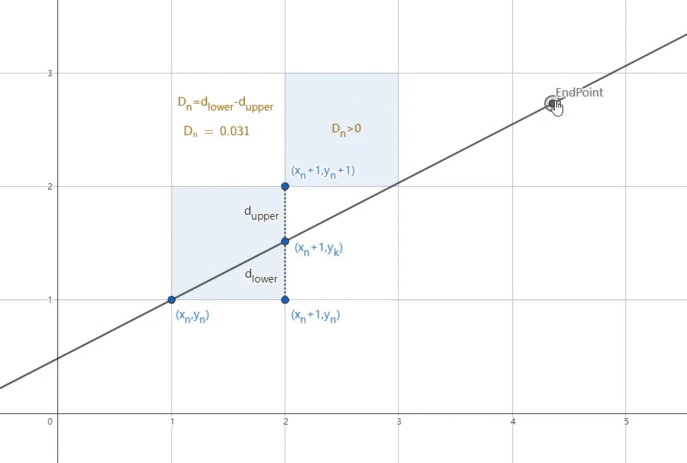

Bresenham's line drawing

# Bresenham's line布雷森汉姆直线笔记



核心逻辑:点距离哪个光栅点近就选择哪个光栅点

线段起始点为 $(x_n,y_n)$, 终止点为 $(x_e,y_e)$,  $k=\frac{\Delta y}{\Delta x}$

先讨论直线斜率k,  $0\leq k\leq 1$且 $x_n<x_e,y_n<y_e$的情况下

因为 $0\leq k\leq 1$,所x变化比y快,固定x的步长为1,探讨每步y的位置

当前进一步后点 $(x_n+1,y_k)$

​	与上方光栅点 $(x_n+1,y_n+1)$的距离为 $d_{upper}=y_n+1-y_k$

​	与下方光栅点 $(x_n+1,y_n)$的距离为 $d_{lower}=y_k-y_n$

如果 $d_{lower}\gt d_{upper}$则与上方点接近,下一个点选择上方,反之y不变
$$
\begin{split}
设D_n &= d_{lower}-d_{upper}\\
&=y_k-y_n-(y_n+1-y_k)\\
&=2y_k-2y_n-1\\
&=2(k(x_n+1) +b)-2y_n-1\\
&=2kx_n-2y_n+2k+2b-1
\end{split} \\
$$
 $用D_n推算D_{n+1}$
$$
\begin{split}
D_{n+1}&=2kx_{n+1}-2y_{n+1}+2k+2b-1\\
D_{n+1}-D_n&=2k(x_{n+1}-x_n)-2(y_{n+1}-y_n)\\
D_{n+1}&=D_n+2k-2(y_{n+1}-y_n)\\
&=
\left\{\begin{array}{l}
D_n+2k-2 & (D_n\gt0,y_{n+1}=y_n+1)\\
D_n+2k & (D_n\leq0,y_{n+1}=y_n)
\end{array} \right.
\end{split}
$$
 $用y_n = kx_n +b\quad将b带回Dn$
$$
\begin{split}
D_n&=2kx_n-2y_n+2k+2b-1\\
&=2kx_n-2y_n+2k+2(y_n-kx_n)-1\\
&=2k-1
\end{split}
$$
整理式子
$$
\begin{split}
D_n&=2k-1\\
D_{n+1}&=\left\{\begin{array}{l}
D_n+2k-2 & (D_n\gt0)\\
D_n+2k & (D_n\leq0)
\end{array} \right.
\end{split}\\
$$
因为只需要判断正负不需要实际的值,所以进一步优化, $k=\frac{\Delta y}{\Delta x}$
$$
\begin{split}
\Delta xD_n&=2\Delta x-\Delta y\\
\Delta xD_{n+1}&=\left\{\begin{array}{l}
\Delta xD_n+2\Delta y-2\Delta x & (D_n\gt0)\\
\Delta xD_n+2\Delta y & (D_n\leq0)
\end{array} \right.
\end{split}
$$
这样也不用算k了,判别式 $D=2\Delta x-\Delta y$
直接判断D的正负值选择下一个点
然后用 $D_{n+1}$的式子更新判别式D的值进入下一个判断

伪代码

```
起始点(x0,y0)终止点(xe,ye)
dx是x方向的增量绝对值
dy是y方向的增量绝对值
d是判别式:2dx-dy;

输出起始点位置
开始循环.结束条件x到xe
x=x+1
判别式d大于零则y=y+1,更新判别式d=d+2dy-2dx;
判别式d小于等于零则y不变,更新判别式d=d+2dy;
输出位置
循环
```

以上只是讨论了 $0\leq k\leq 1, x_n<x_e,y_n<y_e$的情况,其它的就视情况变化

```
dx = xe - x0;
dy = ye - y0;
dx1 = fabs(dx);
dy1 = fabs(dy);
如果|k|<=1即x变化比y快分类
	如果dx < 0 需要xe开始增加到x0
	如果(dx<0 && dy<0) || (dx>0 && dy>0) 即k为正y是向上增加 反之k为负需要减少y=y-1
其它y变化比x快,固定y的步长为1探讨x的选择
```

详细代码可以查看https://stackoverflow.com/a/16405254的回答