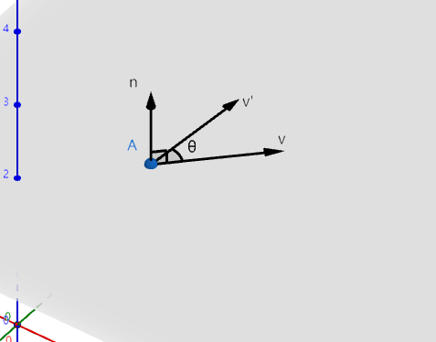
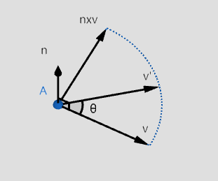
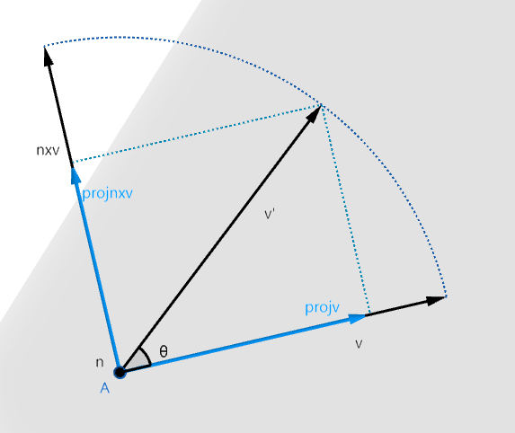
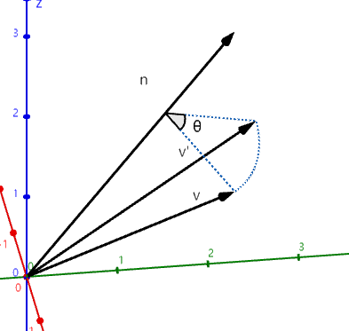
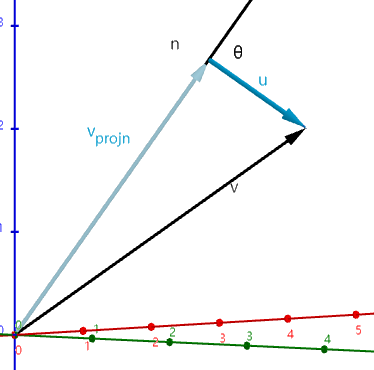
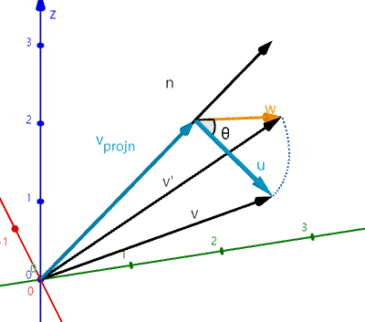

# Rodrigues’ Rotation Formula 沿任意轴旋转公式

### 前置

首先我们先讨论一种简化的问题:有一个平面,上有点A,点A处的法向量 $\vec{n}$,和向量 $\vec{v}$.  

 $\vec{v}$绕 $\vec{n}$旋转θ角得到 $\vec{v'}$,  求 $\vec{v'}$

先将法向量归一化 $\hat{n}=\frac{\vec{n}}{||\vec{n}||}$

 $\hat{n}\times\vec{v}$ 的到垂直与 $\hat{n}$和 $\vec{v}$ 同时长度为 $||\vec{v}||$的向量,

可以暂时从二维的角度看平面,将 $\vec{v'}$投影到 $\vec{v}$和 $\hat{n}\times\vec{v}$

 $\vec{v'_{projV}}=\cos{\theta}\vec{v}$, $\vec{v'_{projnxv}}=\sin{\theta}({\hat{n}\times\vec{v}})$

$$
投影向量计算过程\\
projV长度:||v'||*\cos{\theta} \\
projV方向:\hat{v}=\frac{\vec{v}}{||\vec{v}||}\\
\vec{v'_{projV}} = ||v'||*\cos{\theta}\frac{\vec{v}}{||\vec{v}||}=\cos{\theta}\vec{v}\\
同理\vec{v'_{projnxv}}=\sin{\theta}({\hat{n}\times\vec{v}})
$$

最后得解 $\vec{v'}=\vec{v'_{projV}}+\vec{v'_{projnxv}}=\cos{\theta}\vec{v}+\sin{\theta}({\hat{n}\times\vec{v}})$

记住这个结论下面将用到

### 开始

设空间中有一向量  $\vec{v}$ 绕  $\vec{n}$ 旋转 θ 到  $\vec{v'}$ 

将  $\vec{v}$ 分解到 $\vec{v}$ 在  $\vec{n}$ 上的投影和垂直到 $\vec{n}$的方向上  $\vec{v}=\vec{v_{projn}}+\vec{u}$

当 $\vec{v}$ 绕  $\vec{n}$ 旋转θ到 $\vec{v'}$, 同时当 $\vec{u}$ 绕  $\vec{n}$ 旋转θ到 $\vec{w}$

 $\vec{v'}=\vec{v_{projn}}+\vec{w}$

 $\vec{u}$垂直 $\vec{n}$, 绕  $\vec{n}$ 旋转θ 利用上面已知的公式可得

 $\vec{w}=\cos{\theta}\vec{u}+\sin{\theta}({\hat{n}\times\vec{u}})$   

 $\hat{n}=\frac{\vec{n}}{||\vec{n}||}$,

 $\vec{v_{projn}}=(\vec{v}\cdot\hat{n})\hat{n}$     

 $\vec{u}=\vec{v}-\vec{v_{projn}}=\vec{v}-(\vec{v}\cdot\hat{n})\hat{n}$

$$
\begin{align}
\vec{v'}&=\vec{v_{projn}}+\vec{w}\\
&=(\vec{v}\cdot\hat{n})\hat{n}+\cos{\theta}(\vec{v}-(\vec{v}\cdot\hat{n})\hat{n})+\sin{\theta}({\hat{n}\times(\vec{v}-(\vec{v}\cdot\hat{n})\hat{n}})\\
&=(1-\cos\theta)(\vec{v}\cdot\hat{n})\hat{n} + \cos{\theta}\vec{v}+\sin\theta(\hat{n}\times\vec{v})\\
\end{align}
$$

#### 转化成矩阵形式

就是把 $\vec{v}$给提取出来 让 $\vec{v'}=R(\hat{n},\theta)\vec{v}$

$$
R(\hat{n},\theta)=\cos{\theta}I+(1-\cos{\theta})\hat{n}\hat{n}^T+\sin{\theta}\left[ \begin{array}{c} 
0 & -n_z & n_y\\ 
n_z & 0 & -n_x \\
-n_y & n_x & 0
\end{array} \right]
$$

需要注意这里用的都是归一化后的 $\hat{n}$

原理就是

 $a⋅b=a^Tb$

 $a×b=\left[ \begin{array}{c} 
0 & -a_3 & a_2\\ 
a_3 & 0 & -a_1 \\
-a_2 & a_1 & 0
\end{array} \right]b$
