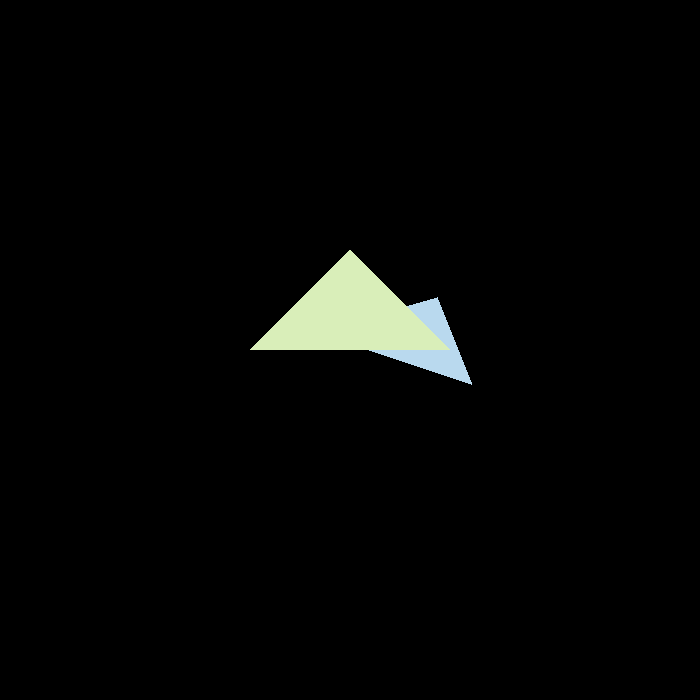
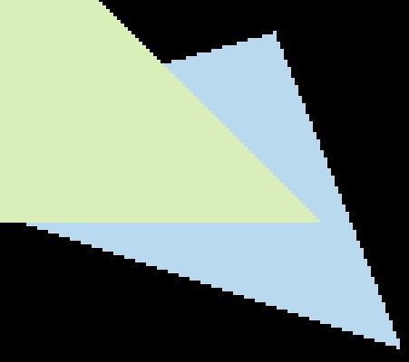
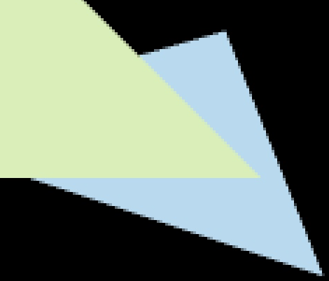
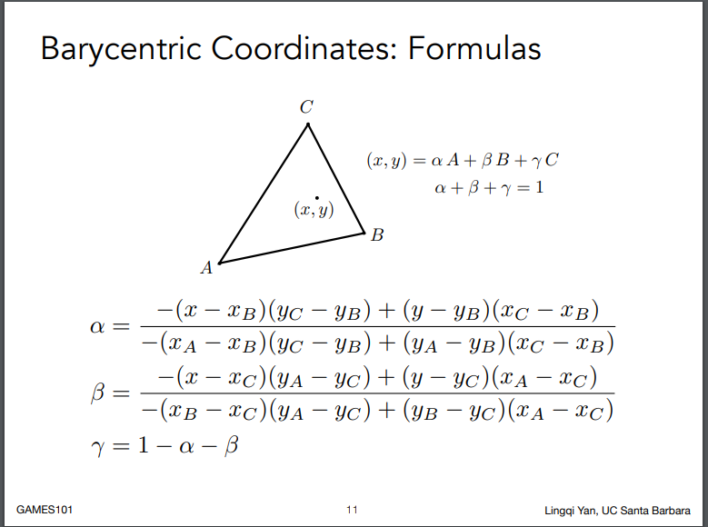

# 作业2

[TOC]

## 作业成果预览








## 作业详解

1. **main.cpp 下的 get_projection_matrix() 函数是空的。请复制粘贴你在第一 次作业中的实现来填充该函数。**

   先将代码复制过来.这里要讨论一个东西,就是作业描述上写:<u>"为了方便同学们写代码，我们将 z 进行了反转，保证都是正数，并且越大表示离视点越远。"</u> [Hw2的疑问](https://games-cn.org/forums/topic/hw2%e7%9a%84%e7%96%91%e9%97%ae/#post-6731) 这里有助教的解释框架使用左手坐标系写的,如果用课程中右手系推导的透视投影矩阵会造成上下颠倒,层级前后颠倒的问题.

   提供两种修改的方法

   ### 方法一

   透视投影矩阵使用左手坐标系,世界坐标还是右手坐标系

   重新推算透视投影矩阵中将透视投影转化为正交投影这步

   ```cpp
       persp2ortho << // 将透视投影转化为正交投影
           zNear, 0, 0, 0,
           0, zNear, 0, 0,
           0, 0, -(zNear + zFar), -zNear * zFar,
           0, 0, -1, 0;
   ```

   这样就不需要修改框架其它地方,[推导过程](./LeftRightMVP.md)

   ### 方法二

   为了好理解,继续使用课程中的透视投影矩阵,还是右手坐标系,并传入n,f为负值需要做以下修改

   1. `main函数中 get_projection_matrix(45, 1, -0.1, -50)`需要传入负值

   2. `rasterizer::draw中Viewport transformation z需要改动`

      `f1 = fabs(-0.1 - (-50)) * 0.5 // f1=fabs(n - f) / 2.0`

      `f2 = (n + f) * 0.5 // f2=(n + f) / 2.0`

      `vert.z() = vert.z() * f1 + f2;`

      ```c++
      float f1 = fabs(-0.1 - (-50)) * 0.5 // f1=fabs(n - f) / 2.0
      float f2 = (-0.1 + (-50)) * 0.5 // f2=(n + f) / 2.0
      /* 略过 */
      vert.z() = vert.z() * f1 + f2;
      ```

   3. `rasterizer::clear中depth的初始值要修改为-infinity`

      因为是-z方向,-infinity排在最底下

   4. 在绘制的时候,绘制深度值大的`z_interpolated > depth_buf[ind]`

2. **static bool insideTriangle(): 测试点是否在三角形内。你可以修改此函 数的定义，这意味着，你可以按照自己的方式更新返回类型或函数参数。**

   ```
   static bool insideTriangle(float x, float y, const Vector3f* _v)
   {   
       // TODO : Implement this function to check if the point (x, y) is inside the triangle represented by _v[0], _v[1], _v[2]
       // 消去z差异,转到一个面上
       Vector3f v[3];
       for(int i=0;i<3;i++)
           v[i] = {_v[i].x(), _v[i].y(), 0};
       Vector3f p = {x, y, 0};
   
       Vector3f a = (v[1] - v[0]).cross(p - v[0]);
       Vector3f b = (v[2] - v[1]).cross(p - v[1]);
       Vector3f c = (v[0] - v[2]).cross(p - v[2]);
   
       // abc同侧则在三角形内
       return (a.dot(b) >= 0) && (a.dot(c) >= 0) && (b.dot(a) >= 0);
   }
   ```

3. **rasterize_triangle(): 执行三角形栅格化算法**

   ```c++
   // 创建三角形的 2 维 bounding box。
   	float minX = std::floor(std::min(std::min(v[0].x(), v[1].x()),v[2].x()));
       float minY = std::floor(std::min(std::min(v[0].y(), v[1].y()),v[2].y()));
       float maxX = std::ceil(std::max(std::max(v[0].x(), v[1].x()),v[2].x()));
       float maxY = std::ceil(std::max(std::max(v[0].y(), v[1].y()),v[2].y()));    
   // 遍历此 bounding box 内的所有像素（使用其整数索引）。
       for (int x = minX; x < maxX; x++)
       {
           for (int y = minY; y < maxY; y++)
           {
               // 使用像素中 心的屏幕空间坐标来检查中心点是否在三角形内。
               if(insideTriangle(x+0.5, y+0.5, t.v))
               {
                   // 计算重心坐标然后插值深度值
                   auto[alpha, beta, gamma] = computeBarycentric2D(x, y, t.v);
                   float w_reciprocal = 1.0/(alpha / v[0].w() + beta / v[1].w() + gamma / v[2].w());
                   float z_interpolated = alpha * v[0].z() / v[0].w() + beta * v[1].z() / v[1].w() + gamma * v[2].z() / v[2].w();
                   z_interpolated *= w_reciprocal;
   
                   int ind = get_index(x, y);
                   if (z_interpolated < depth_buf[ind])
                   {
                       // 如果当前点更靠近相机，请设置像素颜色并更新深度缓冲区 (depth buffer)。
                       depth_buf[ind] = z_interpolated;
                       set_pixel(Eigen::Vector3f(x, y, z_interpolated), t.getColor());
                   }
               }
           }
       }
   ```


## 额外内容1

**用 super-sampling 处理 Anti-aliasing : 你可能会注意 到，当我们放大图像时，图像边缘会有锯齿感。我们可以用 super-sampling 来解决这个问题，即对每个像素进行 2 * 2 采样，并比较前后的结果 (这里 并不需要考虑像素与像素间的样本复用)。需要注意的点有，对于像素内的每 一个样本都需要维护它自己的深度值，即每一个像素都需要维护一个 sample list。最后，如果你实现正确的话，你得到的三角形不应该有不正常的黑边。**

每个像素点原本只采样一次,现在一个像素点均等分,多次采样.每个采样点计算是否在三角形内,深度,和颜色.最后均和一下给像素点.

所以frame_buf和depth_buf会扩展到原本的ssaa*ssaa的倍率

rasterizer.hpp

```
        int ssaa = 1;   // 1*1采样
        int ssaa2 = 1;  // ssaa的平方
        std::vector<Eigen::Vector3f> ssaa_frame_buf;
        std::vector<float> ssaa_depth_buf;
        void set_ssaa(int x);
```

raserizer.cpp

```
//Screen space rasterization
void rst::rasterizer::rasterize_triangle(const Triangle& t) {
    auto v = t.toVector4();
    float minX = std::floor(std::min(std::min(v[0].x(), v[1].x()),v[2].x()));
    float minY = std::floor(std::min(std::min(v[0].y(), v[1].y()),v[2].y()));
    float maxX = std::ceil(std::max(std::max(v[0].x(), v[1].x()),v[2].x()));
    float maxY = std::ceil(std::max(std::max(v[0].y(), v[1].y()),v[2].y()));

    // SSAA
    // 遍历像素
    float ssaa_step = 1.0 / (ssaa * 2);
    for (int i = minX; i < maxX; i++)
    {
        for (int j = minY; j < maxY; j++)
        {
            int sample_ind = 0, sample_cnt = 0;
            int ind = get_index(i, j);
            // 像素点分为ssaa*ssaa,遍历采样
            for (float x = i + ssaa_step; x < i + 1; x += ssaa_step*2)
            {
                for (float y = j + ssaa_step; y < j + 1; y += ssaa_step*2)
                {
                    if (insideTriangle(x, y, t.v))
                    {
                        // 计算重心坐标然后插值深度值
                        auto[alpha, beta, gamma] = computeBarycentric2D(x, y, t.v);
                        float w_reciprocal = 1.0/(alpha / v[0].w() + beta / v[1].w() + gamma / v[2].w());
                        float z_interpolated = alpha * v[0].z() / v[0].w() + beta * v[1].z() / v[1].w() + gamma * v[2].z() / v[2].w();
                        z_interpolated *= w_reciprocal;
                        int ssaa_ind = ind * ssaa2 + sample_ind;
                        
                        if (z_interpolated < ssaa_depth_buf[ssaa_ind])
                        {
                            ssaa_depth_buf[ssaa_ind] = z_interpolated;
                            ssaa_frame_buf[ssaa_ind] = t.getColor();
                            sample_cnt++;
                        }
                    }
                    
                    sample_ind++;
                }
            }

            // 覆盖像素点个数
            if (sample_cnt != 0)
            {
                Eigen::Vector3f color = {0, 0, 0};
                for (int i = 0; i < ssaa2; i++)
                {
                    color += ssaa_frame_buf[ind*ssaa2+i];
                }
                color /= ssaa2;
                set_pixel(Vector3f(i, j, 1.0f), color);
            }            
        }
    }
}
```

## 额外内容2

[推导左手系透视投影矩阵](./LeftRightMVP.md)

重心坐标公式

