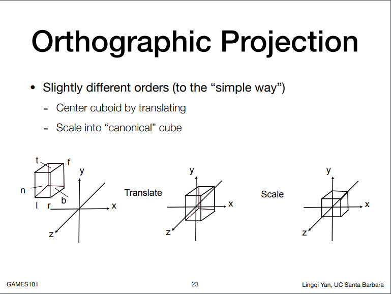

# 推导左手系透视投影矩阵

## 关于games101作业2结果上下颠倒,层级前后颠倒的问题

[Hw2的疑问](https://games-cn.org/forums/topic/hw2%e7%9a%84%e7%96%91%e9%97%ae/#post-6731) 这里有助教的解释框架使用**左手坐标系**写的,如果用课程中**右手坐标系**推导的透视投影矩阵会造成上下颠倒,层级前后颠倒的问题.

首先这里说的用左手坐标系是哪里用?其实并不是整个世界坐标系都用左手,只是指NDC(Normalized Device Coordinates)中使用了左手坐标系. 

注:以下NDC space默认为[-1, 1]^3^

课程中使用了右手坐标系,所以n>f 且n,f都为负值,课程里已经详细推导了右手坐标系的情况,这里不在多说

我们关注当NDC为左手坐标系下

对于左手坐标系,n<f,且n为正值,

透视投影矩阵的作用就是将摄像机坐标系(x,y,z),转换为标准化设备坐标（NDC）

因此是右手坐标系摄像机坐标系通过投影矩阵转化到了NDC左手坐标系

透视投影矩阵拆分为"透视转正交","平移","缩放",

下面开始"透视转正交"的同时转化坐标系

上图紫色是摄像机坐标系(右手),黑色为NDC坐标系(左手)

摄像机坐标系中(x,y,z)因为是右手坐标系,z的值是负值,给定的n是正值,所以在相似三角形边比中要用n/(-z)

$$
y'= \frac{n}{-z}y\qquad x'=\frac{n}{-z}x\\
M_{perp2ortho}\left[\begin{array}{}x\\y\\z\\1\end{array}\right]=\left[\begin{array}{c}\frac{nx}{-z}\\\frac{ny}{-z}\\?\\1\end{array}\right]==\left[\begin{array}{c}nx\\ny\\?\\-z\end{array}\right]\\
\left[\begin{array}{cccc}n&0&0&0\\0&n&0&0\\?&?&?&?\\0&0&-1&0\end{array}\right]\left[\begin{array}{}x\\y\\z\\1\end{array}\right]=\left[\begin{array}{c}nx\\ny\\?\\-z\end{array}\right]\\
$$

特殊点近平面上的点{x, y, -n} 是没有变化的,但是坐标系变化了所以转化为{x,y,n}
$$
M_{perp2ortho}\left[\begin{array}{c}x\\y\\-n\\1\end{array}\right]=\left[\begin{array}{c}x\\y\\n\\1\end{array}\right]==\left[\begin{array}{c}nx\\ny\\n^2\\n\end{array}\right]\\
\left[\begin{array}{cccc}n&0&0&0\\0&n&0&0\\?&?&?&?\\0&0&-1&0\end{array}\right]\left[\begin{array}{c}x\\y\\-n\\1\end{array}\right]=\left[\begin{array}{c}nx\\ny\\n^2\\n\end{array}\right]
$$
特殊点远平面的中点{0, 0, -f}也是x,y不变,z变化{0, 0, f};
$$
M_{perp2ortho}\left[\begin{array}{c}0\\0\\-f\\1\end{array}\right]=\left[\begin{array}{c}0\\0\\f\\1\end{array}\right]==\left[\begin{array}{c}0\\0\\f^2\\f\end{array}\right]\\
\left[\begin{array}{cccc}n&0&0&0\\0&n&0&0\\?&?&?&?\\0&0&-1&0\end{array}\right]\left[\begin{array}{c}0\\0\\-f\\1\end{array}\right]=\left[\begin{array}{c}0\\0\\f^2\\f\end{array}\right]
$$
​	

以上两个等式可以看出矩阵第三行与x,y无关,设第三行为{0, 0, A, B}得
$$
\left\{\begin{array}{c}-nA+B=n^2\\-fA+B=f^2\end{array}\right.\\
解得\left\{\begin{array}{c}A=-(n+f)\\B=-nf\end{array}\right.
$$
所以"透视转正交"得矩阵为
$$
M_{persp2ortho}=\left[\begin{array}{cccc}n&0&0&0\\0&n&0&0\\0&0&-(n+f)&-nf\\0&0&-1&0\end{array}\right]
$$
然后是"平移","缩放"因为已经在上一步做完坐标系的变化,没有特殊情况,就和课程上的一样就不废话了
$$
\left[\begin{array}{cccc}\frac{2}{r-l}&0&0&0\\0&\frac{2}{t-b}&0&0\\0&0&\frac{2}{n-f}&0\\0&0&0&1\end{array}\right]\left[\begin{array}{cccc}1&0&0&-\frac{r+l}{2}\\0&1&0&-\frac{t+b}{2}\\0&0&1&-\frac{n+f}{2}\\0&0&0&1\end{array}\right]\left[\begin{array}{cccc}n&0&0&0\\0&n&0&0\\0&0&-(n+f)&-nf\\0&0&-1&0\end{array}\right]\\
=\left[\begin{array}{cccc}
\frac{2n}{r-l} & 0 & \frac{r+l}{r-l} & 0 \\
0 & \frac{2n}{t-b} & \frac{t+b}{t-b} & 0 \\
0 & 0 & -\frac{n+f}{n-f} & -\frac{2nf}{n-f} \\
0 & 0 & -1 & 0
\end{array}\right]
$$

最后比较一下左右手有什么区别:M(2,2)和M(3,2)的符号颠倒了.其实从得到M~persp2ortho~ 也有相同结果
$$
左手:\quad\left[\begin{array}{cccc}
\frac{2n}{r-l} & 0 & \frac{r+l}{r-l} & 0 \\
0 & \frac{2n}{t-b} & \frac{t+b}{t-b} & 0 \\
0 & 0 & -\frac{n+f}{n-f} & -\frac{2nf}{n-f} \\
0 & 0 & -1 & 0
\end{array}\right]
\qquad右手:\quad\left[\begin{array}{cccc}
\frac{2n}{r-l} & 0 & \frac{r+l}{r-l} & 0 \\
0 & \frac{2n}{t-b} & \frac{t+b}{t-b} & 0 \\
0 & 0 & \frac{n+f}{n-f} & -\frac{2nf}{n-f} \\
0 & 0 & 1 & 0
\end{array}\right]\\
$$

当然我们也能写个代码看看转化过程,数据和作业中的一样eye_pos{0, 0, 5}, 

右手系下n=-0.1, f=-50,  z[4.9~-50]经过model view加 透视转正交后[-0.1, -50] 经过完整的MVP转化到[1, -1] 再转化到屏幕viewport[-0.1,  -50],越大离屏幕越近

左手下n=0.1,f=50,z[4.9~-50]经过model view加 透视转正交后[0.1, 50] 经过完整的MVP转化到[-1, 1] 再转化到屏幕viewport[0.1,  50],越小离屏幕越近

完美~~